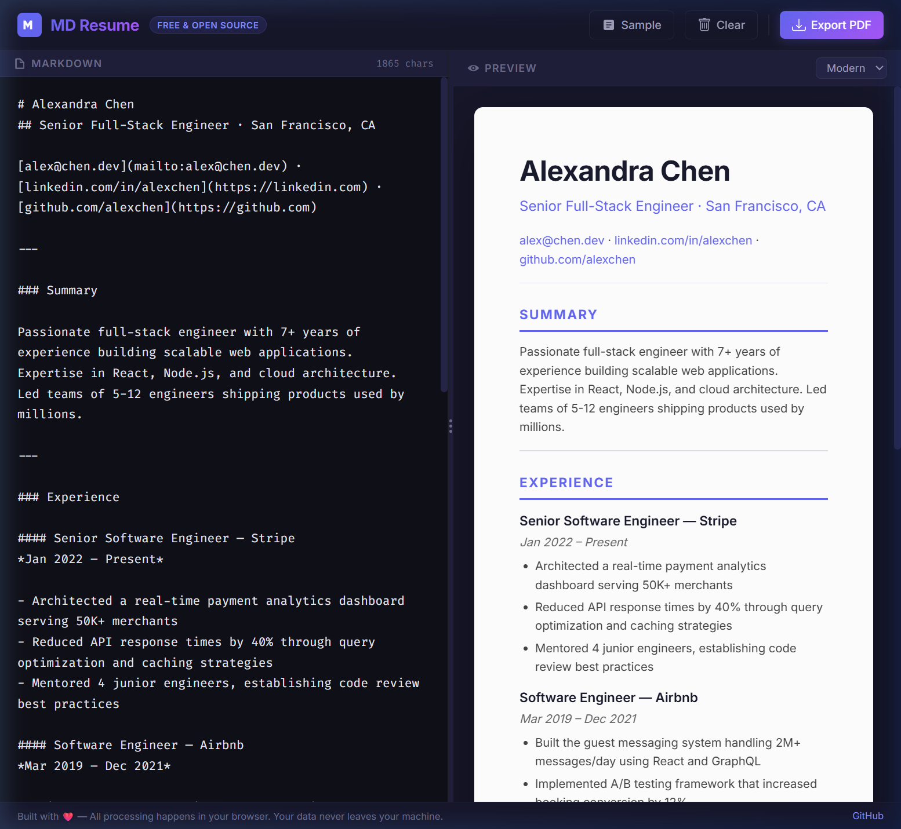

# 🎨 Markdown Resume Builder

A beautiful, free, open-source resume builder that lets you write in Markdown and instantly preview a professionally formatted resume. Export to PDF with one click.

 



## ✨ Features

- **Live Preview** — See your resume update in real-time as you type
- **3 Themes** — Modern, Classic, and Minimal designs
- **PDF Export** — Print or save as PDF with one click
- **100% Client-Side** — No servers, no data collection. Your data stays on your machine
- **Auto-Save** — Content is saved to localStorage automatically
- **Resizable Panes** — Drag to adjust editor/preview split
- **Tab Support** — Tab key inserts spaces in the editor
- **Sample Resume** — Load a pre-built example to get started

## 🚀 Live Demo

Open `index.html` in your browser — that's it! No build step required.

Or deploy to GitHub Pages for a shareable link.

## 📝 Usage

1. Write your resume in Markdown in the left pane
2. Preview updates live in the right pane
3. Choose a theme (Modern, Classic, or Minimal)
4. Click **Export PDF** to save

### Markdown Tips for Resumes

```markdown
# Your Name
## Your Title · Location

---

### Experience

#### Job Title — Company
*Start Date – End Date*

- Achievement or responsibility
- Another bullet point
```

## 🛠️ Tech Stack

- **HTML5** — Semantic structure
- **CSS3** — Custom properties, flexbox, print styles
- **JavaScript** — Vanilla JS, no framework
- **[marked.js](https://marked.js.org/)** — Markdown parsing
- **[Inter](https://fonts.google.com/specimen/Inter)** + **[Fira Code](https://fonts.google.com/specimen/Fira+Code)** — Typography

## 📄 License

MIT — free for personal and commercial use.
